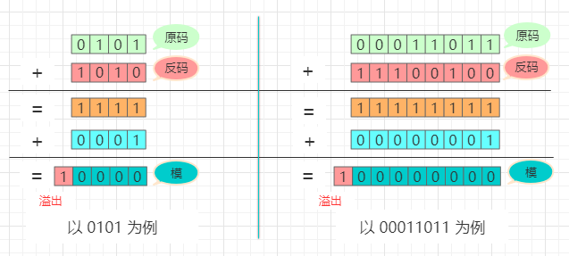
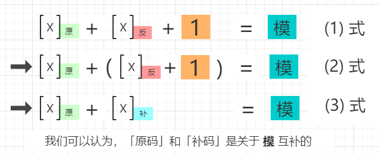
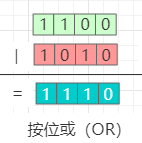
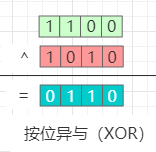
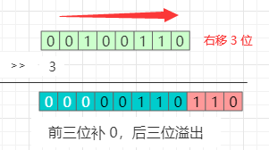
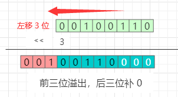

# 在 OpenResty 中如何完成 bit 操作

编程世界中的所有东西都会从 **位 (bit)** 开始，以 **位 (bit)** 结束。刚步入编程世界的初学者看到整数就是整数，看到字符串就是字符串。

但在功力深厚的程序员眼中，无论是 “整数” 还是 “字符串”，它们都是 **位 (bit)**。电影《黑客帝国》中，主人公尼奥眼里的史密斯就是由绿色位代码构成的计算机程序。

与系统编程不同，我们可以感觉到在一般的应用程序编程中对位运算的要求并不高。

本文分为以下 6 个部分：

- 一，复习二进制补码
- 二，复习位运算
- 三，OpenResty 中的 bit 操作
- 四，Lua BitOp API 简介
- 五，位运算算法实例
- 六，参考资料

## 一，复习二进制补码

#### 1，在计算机中以什么形式来存储数字？
以二进制形式存储，其实所有数据都是以二进制形式存储的，这是由计算机硬件决定的。

#### 2，负数在计算机中如何表示？
我们知道现代电子计算机只能识别二进制的 0 和 1 两个元素，而现实中的 **数** 却有正负数之分，那么负数在计算机中如何表示呢？

例如，想表示二进制数 `1010` 的负数，不能使用 `-1010` 的形式，因为这引入了 0 和 1 之外的符号，计算机不能识别。

计算机的设计者们没有引入新的符号，而是设计了 **补码** 来表示负数（这是一项伟大的发明）。

在二进制补码体系中，数字的表示法有以下三种：原码、反码、补码。（我们可以先记住下面的结论）

> - 原码：符号位加上真值的绝对值，即用最高位（左边第一位）表示符号，0 表示正，1 表示负，其余位表示值的大小。
> - 反码：
      - 正数的反码与其原码相同；
      - 负数的反码是在其原码的基础上, 符号位不变，其余逐位取反所得。
> - 补码：
      - 正数的补码就是其本身；
      - 负数的补码是在其原码的基础上, 符号位不变, 其余各位取反，然后+1。 (即在反码的基础上+1)

#### 3，为什么定义上述的方法计算补码？

> 这里我们假定计算机的 **字长** 为 8 位。以下为个人理解，如有错误，请各位指出，非常感谢。
- 首先，我们来认识 **模** 的概念。

  **模**，可以理解为一个具有周期性的计数系统的最小正周期。

  例如，时钟的一个周期为 12 小时，一周的周期为 7 天，一年的周期为 12 个月，角度的周期为 360 度，二进制的逢 2 进 1，十进制的逢 10 进 1。

  

- 接着，我们来验证一个结论：**不管是几位的二进制数，它的 「原码」 + 「反码」 + 1 = 模**。

    

- 然后，我们来看等式的变形：

    

- 最后，再来回顾一下补码的计算方法，步骤如下：
  - step 1: 取绝对值；
  - step 2: 逐位取反；
  - step 3: 给 step 2 得到的结果 + 1。

这个方法并不是补码的理论基础，而是因为它最简单、直接和高效，在设计 CPU 时也会省去一些麻烦。取补码在 CPU 内部由补码电路完成。

这也是为什么高位可以直接舍弃的原因，因为高位永远会是模的倍数，在模的过程中会被清 0。


#### 4，为什么这样定义符号位？符号位又是如何参与运算的？
其实，从上面的示例可知，计算机在运算过程中根本就 **完全没有考虑符号位**，而是仅仅执行了单纯的加法运算。运算的结果，也没有人为地添加符号位。

**这是为什么呢？**
原因就是，**符号位本来就不是人为定义的，而是在补码运算中计算所得的**。

正是因为在补码运算中，存在左边第一位（最高位）为 0 则是正数，为 1 则是负数这个规律，我们才方便地 **认定第一位为符号位**，人为定义的符号位不可能满足数学规则参与数学运算。详情请参看 [二进制补码计算原理详解](https://blog.csdn.net/zhuozuozhi/article/details/80896838)。由此，我们就不用死记硬背，也不用那么地在意符号位了。

#### 5，补码的原理是什么？

同余原理，详情请参看 [原码, 反码, 补码 详解](https://www.cnblogs.com/zhangziqiu/archive/2011/03/30/ComputerCode.html)。

#### 6，补码带来哪些好处？
- 1，首先保证了运算的正确性；
- 2，将 **减法** 变成了 **加法**，也不需要定义「正数+正数」和「正数+负数」两套运算规则了；
- 3，为计算机设计电路时，只需要「加法电路+补码电路」，就可以完成所有整数的加法运算了。


## 二，复习位运算

我们先来复习一下 C 语言中，6 种代表性的位运算。为清晰起见本文中称呼所有的位运算的函数为 **按位XX**。

#### 2.1，运算符
| 序号 | 运算符 | 含义 |
|:----:|:----:|----|
| 1 | `&` | **按位与** AND |
| 2 | `|` | **按位或** OR |
| 3 | `^` | **按位异或** XOR |
| 4 | `>>` | **按位右移** right shift |
| 5 | `<<` | **按位左移** left shift |
| 6 | `~` |  **按位取反** NOT |

#### 2.2，位运算的示例

> **布尔代数：1 为真、0 为假。**

#### 2.2.1，**按位与** (AND)
**按位与**（AND）与常用的布尔代数完全一致。

运算规则：**同为 1 则 1，有 0 则 0。**

辅助记忆：**两个和尚抬水吃**，有一个不合作，就没水吃了。


#### 2.2.2，**按位或** (OR)
**按位或**（OR）也与常用的布尔代数完全一致。

运算规则：**同为 0 则 0，有 1 则 1。**

辅助记忆：**一个和尚挑水吃**，两个和尚可以都去挑水，如果都不去，就没水吃了。



#### 2.2.3，**按位异或** (XOR)

运算规则：**相同则为 0，相异则为 1。**

辅助记忆：两个和尚做 **相同** 的事情（都去或者都不去）没水吃，**必须不同** 才有水吃。



#### 2.2.4，**按位右移**（right shift）



```
100110 >> 3 = 000100
```


把二进制数 100110 向右移 3 位，**左侧空出来的位补 0**。
辅助记忆：把一根木条按单位锯成一堆小方块，每锯掉一块，向右移动 1 个单位（bit）。

> Tips：向**右移一位**，相当于将此数 **除以 2**（原数变小了）。

#### 2.2.5，**按位左移**（left shift）


```
100110 << 3 = 110000
```
把二进制数 100110 向左移 3 位，**右侧空出来的位补 0**。
辅助记忆：贪吃蛇游戏，只是每次都把小方块放在最后边。

> Tips：向**左移一位**，相当于将此数 **乘以 2**（原数变大了）。

#### 2.2.6，**按位取反**（NOT）
把数字的二进制表示形式的每一位的 0 变为 1，1 变为 0。

辅助记忆：谍战剧中的角色反转。


## 三，OpenResty 中的 bit 操作

因为从 OpenResty 1.5.8.1 就默认使用 LuaJIT 作为内置组件，我们可以在
LuaJIT 网站介绍 [扩展模块](https://luajit.org/extensions.html) 的页面上看到下面的描述：

> LuaJIT 提供了几个内置扩展模块：
>
> Bit.* —— 位运算模块。
> LuaJIT 支持 [Lua BitOp](https://bitop.luajit.org/) 定义的所有位操作：
>
> ```lua
> bit.tobit,  bit.tohex,  bit.bnot,    bit.band, bit.bor,  bit.bxor,
> bit.lshift, bit.rshift, bit.arshift, bit.rol,  bit.ror,  bit.bswap。
> ```
> 这个模块是 LuaJIT 内置的——您不需要下载或安装 Lua BitOp。Lua BitOp 站点提供了所有 [Lua BitOp API 函数](https://bitop.luajit.org/api.html) 的完整文档。
>
> 在使用模块的任何功能之前，请确保用 `require` 加载该模块：
>
> ```lua
> local bit = require("bit")
> ```
>
> LuaJIT 会忽略已经安装的 Lua BitOp 模块。这样，您就可以在共享安装上同时使用 Lua 和 LuaJIT 的位操作。

## 四，Lua BitOp API 简介

#### 4.1 定义快捷方式

将常用的模块函数缓存在本地变量中是一种常见的（但不是必须的）做法。这作为一种快捷方式，可以节省一些输入，还可以加快解析它们的速度（只有在调用数十万次时才有意义）。

```lua
-- 请将下面的三行代码放在使用位运算开始的位置（这是个好习惯）
local bnot = bit.bnot
local band, bor, bxor = bit.band, bit.bor, bit.bxor
local lshift, rshift, rol = bit.lshift, bit.rshift, bit.rol
-- 等等

-- 使用快捷方式的示例:
local function tr_i(a, b, c, d, x, s)
  return rol(bxor(c, bor(b, bnot(d))) + a + x, s) + b
end
```

请谨记，`and`、`or` 和 `not` 是 Lua 中的保留关键字。它们不能用于变量名或字面量字段名。这就是为什么将相应的位操作函数命名为 `band`、`bor` 和 `bnot`（以及为保持一致性的 `bxor`）的原因。

> 注意：一个常见的陷阱是使用 `bit` 作为局部临时变量的名称 —— 好吧，不要这样做！


#### 4.2 位操作函数的返回值

**请注意**，所有位操作都返回 **有符号** 的 32 位数字（ [原理](https://bitop.luajit.org/semantics.html#range) ）。默认情况下，这些数字打印为有符号的十进制数字。


#### 4.3 位操作函数简介

- ##### (1) y = bit.tobit(x)

    将一个数字归一化为位运算的数值范围并返回。通常不需要这个函数，因为所有的位运算都已经对其所有的输入参数进行了归一化处理。详情请查看 [操作语义](http://bitop.luajit.org/semantics.html)。

    ```lua
    print(0xffffffff)                --> 4294967295 (*)
    print(bit.tobit(0xffffffff))     --> -1
    print(bit.tobit(0xffffffff + 1)) --> 0
    print(bit.tobit(2^40 + 1234))    --> 1234
    ```

- ##### (2) y = bit.tohex(x [,n])

    将函数的第一个参数转换为十六进制字符串。

    - 十六进制数字显示的数目由可选的第二个参数的绝对值给出。
    - 介于 1 到 8 之间的正数会生成小写的十六进制数字。
    - 负数生成大写的十六进制数字。
    - 仅使用最低有效的 4 * |n| 位。
    - 默认值：生成 8 个小写的十六进制数字。

    ```lua
    print(bit.tohex(1))              --> 00000001
    print(bit.tohex(-1))             --> ffffffff
    print(bit.tohex(0xffffffff))     --> ffffffff
    print(bit.tohex(-1, -8))         --> FFFFFFFF
    print(bit.tohex(0x21, 4))        --> 0021
    print(bit.tohex(0x87654321, 4))  --> 4321
    ```

- #### (3) y = bit.bnot(x)   **按位 NOT**

    返回其参数的 **按位 NOT** 的结果。

    ```lua
    print(bit.bnot(0))            --> -1
    printx(bit.bnot(0))           --> 0xffffffff
    print(bit.bnot(-1))           --> 0
    print(bit.bnot(0xffffffff))   --> 0
    printx(bit.bnot(0x12345678))  --> 0xedcba987
    ```

- ##### (4) y = bit.bor(x1 [,x2...])  **按位或**
    返回其所有参数的 **按位或** 运算结果。允许使用两个以上的参数。

    ```lua
    print(bit.bor(1, 2, 4, 8))                --> 15
    ```

- ##### (5) y = bit.band(x1 [,x2...])   **按位与**
    返回其所有参数的 **按位与** 运算结果。允许使用两个以上的参数。

    ```lua
    printx(bit.band(0x12345678, 0xff))        --> 0x00000078
    ```

- ##### (6) y = bit.bxor(x1 [,x2...])    **按位异或**
    返回其所有参数的 **按位异或** 运算结果。允许使用两个以上的参数。

    ```lua
    printx(bit.bxor(0xa5a5f0f0, 0xaa55ff00))  --> 0x0ff00ff0
    ```

- ##### (7) y = bit.lshift(x, n)          **按位逻辑左移**
    返回其第一个参数 **按位逻辑左移** 的运算结果，移动的位数由第二个参数给出。

    ```lua
    -- 按位逻辑左移
    print(bit.lshift(1, 0))              --> 1
    print(bit.lshift(1, 8))              --> 256
    print(bit.lshift(1, 40))             --> 256
    ```

- ##### (8) y = bit.rshift(x, n)           **按位逻辑右移**
    返回其第一个参数 **按位逻辑右移** 的运算结果，移动的位数由第二个参数给出。
    ```lua
    -- 按位逻辑右移
    print(bit.rshift(256, 8))            --> 1
    print(bit.rshift(-256, 8))           --> 16777215    -- 符号位没有被保留
    ```

    > 以上两种 **逻辑移位** (Logical shifts) 操作会将第一个参数视为 **无符号** 数，最小移位可以是 0 位。

- ##### (9) y = bit.arshift(x, n)           **按位算术右移**

    返回其第一个参数 **按位算术右移** 的运算结果，移动的位数由第二个参数给出。

    ```lua
    -- 按位算术右移（符号位会被保留）
    print(bit.arshift(256, 8))           --> 1
    print(bit.arshift(-256, 8))          --> -1

    -- 三种移位运算的十六进制表示形式
    printx(bit.lshift(0x87654321, 12))   --> 0x54321000
    printx(bit.rshift(0x87654321, 12))   --> 0x00087654
    printx(bit.arshift(0x87654321, 12))  --> 0xfff87654
    ```

    > **算术右移** (Arithmetic right-shift) 操作会将最高有效位视为符号位，并且会在移动过程中被复制保留下来。
    仅使用移位计数的低 5 位（减小到 [0...31] 范围）。

- ##### (10) y = bit.rol(x, n)          **按位向左旋转**

    返回其第一个参数 **按位向左旋转** 的运算结果，旋转位数由第二个参数给出。
    从一边移出的位元会从另一边移回来。

    ```lua
    printx(bit.rol(0x12345678, 12))   --> 0x45678123
    ```

- ##### (11) y = bit.ror(x, n)          **按位向右旋转**

    返回其第一个参数 **按位向右旋转** 的运算结果，旋转的位数由第二个参数给出。
    从一边移出的位元会从另一边移回来。

    ```lua
    printx(bit.rol(0x12345678, 12))   --> 0x45678123
    printx(bit.ror(0x12345678, 12))   --> 0x67812345
    ```
    > 以上两种旋转操作都是只使用较低的 5 位旋转计数 (减少到范围 [0..31])。

- ##### (12) y = bit.bswap(x)         **交换字节**
    交换其参数的字节并返回它。这可用于将小端 32 位数字转换为大端 32 位数字，反之亦然。

    ```lua
    printx(bit.bswap(0x12345678)) --> 0x78563412
    printx(bit.bswap(0x78563412)) --> 0x12345678
    ```

## 五，位运算算法实例

### 示例 1： LeetCode 的 Missing Number：
**(1) 题目描述：**

> 给定一个从 0 到 n 没有重复数字组成的数组，其中有一个数字漏掉了，请找出该数字。
要求：算法具有线性的时间复杂度，并且只占用常数的额外空间复杂度。

**(2) 题目分析**：

- 思路一：对数据进行排序，然后依次扫描，便能找出漏掉的数字。
    - 缺点：基于比较的排序算法的时间复杂度至少是 O(nlogn)，不满足题目要求。

- 思路二：先对 0 到 n 求和，记为 sum1，再对给定的数组求和，记为 sum2，二者之差即为漏掉的数字。

- 思路三：比加法更高效的运算是「按位异或 (XOR) 运算」。我们这里采用位运算来求解。

> Tips: **按位异或** 运算的一个重要性质：
> 做运算的两个数相同时，结果为 0，不相同时结果为1。这个性质可以扩展到多个数做按位异或运算。

**(3) 复杂度：**
- 时间复杂度：O(n)，空间复杂度：O(1)。

**(4) 实例代码：**
> missingNumber.lua 文件：
```lua
local bit = require("bit")

local bnot = bit.bnot
local band, bor, bxor = bit.band, bit.bor, bit.bxor
local lshift, rshift, rol = bit.lshift, bit.rshift, bit.rol

function missingNumber(nums)
    -- 方法一：
    -- 1，先拿 x 与 0~n 的数字做 按位异或 运算
    local x = 0
    for i = 0, #nums do
        x = bit.bxor(x, i)
    end

    -- 2，再拿上一步的 x 与给定数组的元素一一做 按位异或 运算
    for k,v in ipairs(nums) do
        x = bit.bxor(x, v)
    end

    -- 方法二：
    -- 由于 bxor() 支持多个参数，可以将以上两步合并成下面的一个循环
    -- for k, v in ipairs(nums) do
    --     x = bit.bxor(x, k, v)
    -- end

    print("The missing number is: " .. x)
end

-- 实际调用
local nums = {0, 1, 2, 3, 5}
missingNumber(nums)
```

### 示例 2：LeetCode 的 Power of Two：
**(1) 题目描述：**

> 给定一个整数，判断它是否为 2 的幂。

**(2) 题目分析**：
2 的整数幂的有一个**重要特点：** 2 的整数幂对应的二进制形式中只有一个位是 1。
所以我们要做的就是判断输入的这个数的二进制形式是否符合这一条件。

> 注意：当输入的数为负数时，一定不是 2 的幂。

**(3) 复杂度：**
- 时间复杂度：O(n)，空间复杂度：O(1)。

> isPowerOfTwo.lua 文件：
```lua
function isPowerOfTwo(num)
    -- 首先判断 num 是否为负数
    if num < 0 then
        print('这个数是负数，不是 2 的幂。')
        return false
    end

    local hasOne = false
    while num > 0 do
        -- 判断这个数和 1 做 与运算的结果是否不为 0
        if band(num, 1) ~= 0 then  -- 注意这里的条件写法
            if hasOne then         -- 判断 hasOne 是否为 ture
                return false       -- 如果是 ture，则说明该数字的二进制形式里 1 的数目多于 1 个
            else
                hasOne = true
            end
        end
        print('移位前： ' .. num)
        num = rshift(num, 1)        -- 将这个数字右移一位
        print('移位后： ' .. num)
        print(hasOne)
    end
    return hasOne;
end

local num = 8
local result = isPowerOfTwo(num)

-- 输出结果：
if result == true then
    print('这个数 '.. num ..'，是 2 的幂。')
else
    print('这个数'.. num ..'，不是 2 的幂。')
end
```

### 示例 3：LeetCode 的 Number of 1 Bits：
**(1) 题目描述：**

> 给定一个整数，求出它的二进制形式所包含 1 的个数。
>
> 例如，32 位整数 11 的二进制形式为 00000000000000000000000000001011，那么函数返回 3。

**(2) 题目分析**：
设输入的数为 num，把 num 与 1 做二进制的 **按位与** (AND) 运算，即可判断它的最低位是否为 1。

**(3) 解法一：**
如果最低位为 1 的话，把计算变量加一，然后把 num 向右移动一位，重复上述操作。
当 num 变为 0 时，终止算法，输出结果。

**(4) 复杂度：**
- 时间复杂度：O(log2v)，log2v 为二进制数的位数，空间复杂度：O(1)。

> numberOf1Bits-1.lua 文件：
```lua
function numberOf1Bits-1(num)
    local count = 0
    while num > 0 do
        count = count + band(num, 1)
        num = rshift(num, 1)
    end
    return count
end

-- 测试
local num = 7
local result = numberOf1Bits-1(num)
-- 输出结果
print(result)   --> 3
```

**(5) 解法二：**
n & (n - 1) 可以消除最后一个 1，所以用一个循环不停地消除 1 同时计数，直到 n 变成 0 为止。

**(6) 复杂度：**
- 时间复杂度：O(m)，m 为数字 num 的二进制表示形式中 1 的个数，空间复杂度：O(1)。

> numberOf1Bits-2.lua 文件：
```lua
function numberOf1Bits-2(num)
    local count = 0
    while num ~= 0 do
        num = band(num, num - 1)
        count = count + 1
    end
    return count
end

-- 测试
local num = 7
local result = numberOf1Bits-2(num)
-- 输出结果
print(result)   --> 3
```

### 示例 4：Eratosthenes 筛法（素数筛）的一个实现

该算法可以计算出 [1, N] 区间内素数的个数。

```lua
local bit = require("bit")
local band, bxor = bit.band, bit.bxor
local rshift, rol = bit.rshift, bit.rol

local m = tonumber(arg and arg[1]) or 100000

if m < 2 then
    m = 2
end

local count = 0
local p = {}

for i = 0, (m+31)/32 do
    p[i] = -1
end

for i = 2, m do
  if band(rshift(p[rshift(i, 5)], i), 1) ~= 0 then
    count = count + 1
    for j = i+i, m, i do
      local jx = rshift(j, 5)
      p[jx] = band(p[jx], rol(-2, j))
    end
  end
end

io.write(string.format("从 1 到 %d，共有 %d 个素数，\n", m, count))
```


Lua BitOp 相当快。在安装了标准 Lua 的 3GHz CPU 上，该程序可以在不到 90 毫秒的时间内运行完毕，但是执行了超过 100 万次的位函数调用。如果您想要更高的速度，请查看 [LuaJIT](http://luajit.org/)。

## 六，参考资料
- 1，《枕边算法书》
- 2，[LeetCode](https://leetcode-cn.com/)
- 3，[LuaBitOp](http://bitop.luajit.org)
- 4，[二进制补码计算原理详解](https://blog.csdn.net/zhuozuozhi/article/details/80896838)
- 5，[原码, 反码, 补码 详解](https://www.cnblogs.com/zhangziqiu/archive/2011/03/30/ComputerCode.html)
- 6，[原码、反码、补码 详解！不懂的请看过来！](https://zhuanlan.zhihu.com/p/91967268)
- 7，[彻解“补码”](https://zhuanlan.zhihu.com/p/80618244)
